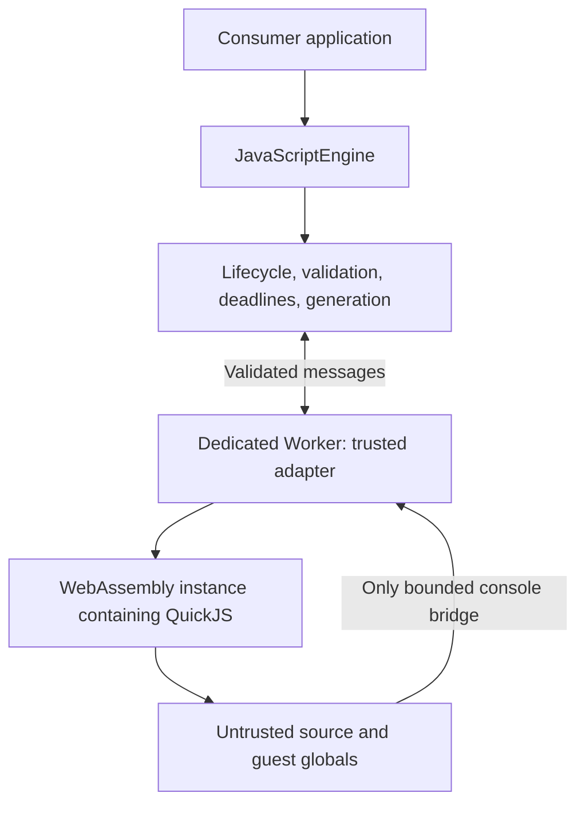

# Architecture and lifecycle

Status: Stage 0 design, 2026-09-24. Normative statements in this document describe required future behavior; no engine exists yet.

## Scope and dependency direction

JavaScript Browser Engine is an embeddable browser execution library. The public `JavaScriptEngine` class hides initialization, Worker ownership, runtime acquisition, validation, limits, execution, cancellation, normalized results, reset, recovery, message validation, and stale-response protection.

The engine does not own editors, terminals, tabs, file trees, application routing/state, themes, layouts, accounts, collaboration, persistence, authentication, or cloud services. It accepts one source string and a diagnostic filename. A filename is never a file path to load. The future application consumes the public API and decides how to display text/results.

Parsing, AST inspection, diagnostics, formatting, and tokenization are separate optional future capabilities. They add no work to `run()` unless independently justified and requested.

## Selected boundary

The controller and Worker adapter are trusted engine code. Guest source is interpreted by QuickJS inside WASM. Never pass it to host `eval`, `Function`, script elements, `import()`, `importScripts()`, or a Worker constructor. QuickJS guest `eval` and `Function` remain guest operations subject to the same runtime limits.

A dedicated Worker is an availability and termination mechanism, not an origin or capability sandbox. QuickJS exposes only explicitly installed host functions; WASM constrains its memory/import boundary. The browser, QuickJS, binding library, console bridge, and asset supply chain remain trusted. See [security](security.md) for residual risks.

An opaque iframe is not part of the first architecture. A native iframe still has its own DOM and browser capabilities; adding it around the embedded runtime would introduce another bootstrap, CSP, origin, message, and lifecycle layer. The selected guest cannot refer to either a Window or WorkerGlobalScope in the first place. This is a suitability decision, not a claim that a same-origin Worker provides opaque-origin isolation. A future defense against a compromised adapter may justify a separate-origin broker; that would need a new decision and full testing. There is no fallback to native guest execution if WASM or Workers fail.

## Runtime and state ownership

One engine owns at most one active dedicated Worker and one admitted run. No queue or worker pool. Independent engines have separate Workers and WASM instances; applications remain responsible for how many engine instances they create.

`initialize()` boots the Worker, loads trusted runtime assets, validates the runtime/protocol version, and performs a small adapter self-check. A normal run creates a fresh QuickJS runtime and context, installs only the permitted console bridge, executes, normalizes bounded output/error information, and disposes all handles/context/runtime before accepting another run. The Worker and WASM instance may stay warm. No guest variable, modified intrinsic, pending job, or object survives a completed run.

The warmed WASM memory may retain its high-water allocation and freed bytes until Worker replacement; fresh contexts are semantic isolation, not a secure memory-erasure guarantee. `reset()` destroys the Worker and its WASM instance, then boots a new generation. Cancelled, timed-out, or faulty runtimes are also replaced. Trusted immutable asset bytes may be browser-cached; guest state may not be cached.

## Lifecycle states

| State | Meaning | Allowed next states |
| --- | --- | --- |
| `created` | No initialization attempted | `initializing`, `disposed` |
| `initializing` | Initial boot or explicit retry, under initialization deadline | `ready`, `failed`, `recovering`, `disposed` |
| `ready` | Runtime transport healthy, accepts one run | `busy`, `recovering`, `disposed` |
| `busy` | One admitted run; execution/normalization/cleanup under deadline | `ready`, `recovering`, `disposed` |
| `recovering` | Invalid generation revoked; one replacement boot under recovery deadline | `ready`, `failed`, `disposed` |
| `failed` | No usable Worker; previous boot/recovery failed | `initializing`, `disposed` |
| `disposed` | Terminal; no live engine-owned execution resources | None |

Every unlisted transition is invalid. Public API misuse rejects with an `EngineError` without changing state. Internal transition violations invalidate the runtime and produce `RUNTIME_FAILURE`; they must not leave a live unsafe runtime or an unresolved operation.

`isReady()` means exactly `state === "ready"`. `isBusy()` means exactly `state === "busy"`; initialization and recovery are separately observable via `getState()`. No public lifecycle event emitter is introduced in the initial contract.

## Operation semantics and races

| Operation | Behavior |
| --- | --- |
| `initialize()` in `created` / `failed` | Start one bounded boot; resolve only after validated `ready`; failure leaves `failed` |
| `initialize()` in `initializing` / `recovering` | Join the current readiness operation; no second Worker |
| `initialize()` in `ready` / `busy` | Resolve immediately; does not wait for a run or change its state |
| `run()` | Admit only in `ready` after validation; transition to `busy` before sending; reject concurrent calls with `BUSY` |
| `cancel()` in `busy` | Revoke active run as `CANCELLED`, terminate Worker, start one recovery; resolve after replacement is ready |
| `cancel()` in `recovering` | Join current recovery; do not initiate another replacement |
| `cancel()` in `created` / `initializing` / `ready` / `failed` | Resolve as a no-op; cancellation concerns admitted runs only |
| `reset()` in `created` / `failed` | Start a fresh initialization and resolve when ready |
| `reset()` in `initializing` | Supersede existing readiness operation with `RESET`; terminate it and start recovery |
| `reset()` in `ready` / `busy` | Invalidate generation; active run settles with `RESET`; start recovery |
| `reset()` in `recovering` | Join replacement already in progress; avoids reset storms |
| `dispose()` in any state | Immediately mark terminal, revoke generation, terminate Worker, clear timers/listeners, settle pending operations; repeated calls are no-ops |

All asynchronous operations after disposal reject `DISPOSED`. Introspection remains available and never returns runtime object references. Calls to `dispose()` itself do not throw due to cleanup errors. `getRuntimeInfo()` returns an immutable snapshot of declared/observed metadata with `initialized: false` once disposed.

For competing result, timeout, cancellation, reset, and dispose events, the controller accepts the first valid terminal decision it processes for the current operation. A result processed at or after its host deadline becomes `EXECUTION_TIMEOUT`, even if the timer task has not fired yet. Once settled, subsequent events cannot rewrite that result. Disposal always makes the *current state* terminal even if an earlier run already completed.

When a run is aborted, its promise settles after logical invalidation and the `terminate()` call, without waiting for replacement initialization. Its result describes the run's original failure. `cancel()`, `reset()`, or a concurrent `initialize()` can be awaited for readiness and reject separately if recovery fails. This prevents a failed recovery from disguising the original cancellation as a program error.

## Cancellation and recovery algorithm

1. Capture the current request identity and select its single terminal outcome.
2. Revoke its generation before processing any more transport events; detach its listeners and cancel its deadlines.
3. Call `Worker.terminate()` on that Worker. Do not send a cancel message and wait for a blocked worker to read it.
4. Settle the admitted run exactly once, preserving only already validated, bounded output.
5. Enter `recovering`, allocate a new generation and Worker, and start the recovery deadline.
6. Accept only that generation's validated boot response. Success enters `ready`; any failure terminates the new Worker, rejects readiness waiters, and enters `failed`.

There is at most one automatic recovery attempt per invalidation. A failure during recovery never starts a recursive retry loop. A later explicit `initialize()` or `reset()` can retry from `failed`.

Syntax errors and ordinary guest exceptions permit reuse of the Worker only after guest runtime cleanup succeeds. Worker `error`, `messageerror`, WASM traps, adapter failures, invalid current-generation messages, execution timeouts, and failed cleanup invalidate it. An idle Worker failure also triggers one bounded recovery. Every listener and timer closes over the generation and operation it belongs to; stale callbacks cannot clear new timers or change state.

Worker termination is specified to abort running script. It does not offer a completion acknowledgment, a process kill, or a browser-wide memory guarantee. QuickJS's interrupt hook is an additional deadline check during guest execution; it is not a replacement for host-controlled termination. [Worker termination specification](https://html.spec.whatwg.org/multipage/workers.html#terminate-a-worker)

## Timeout policy

| Category | Starts | Covers | On expiry |
| --- | --- | --- | --- |
| Initialization | Before Worker construction / asset loading | Creation, load/compile, adapter self-check, ready validation | Terminate, reject `INITIALIZATION_TIMEOUT`, enter `failed` |
| Execution | At admission, before request send | Transport, guest allocation/evaluation, formatting, cleanup, result validation | Terminate, return `EXECUTION_TIMEOUT`, recover |
| Recovery | Before replacement Worker creation | Entire single replacement attempt | Terminate, reject `RECOVERY_TIMEOUT`, enter `failed` |
| Analysis | Not present | Future independent request and budget | Must be designed before analysis exists |

Use host monotonic elapsed time for public deadlines/duration. The Worker maintains its own local deadline using the remaining execution budget sent by the controller; never compare absolute `performance.now()` timestamps from different realms. Numeric budgets are centralized and calibrated in Phase 1, as described in [limits](limits.md).

Browsers throttle or suspend timers, and no JavaScript can settle promises while its page/agent is suspended. Thus deadlines are deterministic outcome rules, not real-time guarantees. On resumption, check deadlines before accepting results; terminate expired work at the earliest available host turn. A crashed browser/process is outside the library's recovery guarantee. With a running host event loop, every transitional state has a bounded exit to `ready`, `failed`, or `disposed`.

## Minimality review

No iframe broker, backend, UI framework, parser, scheduler, plugin registry, filesystem, module resolver, event bus, runtime pool, persistent sessions, or opaque guest value serialization is required for the initial profile. Internal concerns have owners, but folders/classes are created only when real implementation warrants them. Distribution work must preserve this dependency direction and the public contract.
