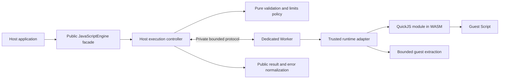

# Component and state ownership audit

Status: **PROPOSED architecture**, 2026-09-24. This document refines the Stage 0 [architecture](../architecture.md) without creating source modules. The browser and binding behaviors cited in [runtime research](../runtime.md) are **DOCUMENTED**; no engine behavior has been browser tested.

## Physical boundary and dependency direction

The engine consists of the facade, controller, validators, immutable policy, protocol, Worker adapter, and normalizers. The **runtime** is the selected QuickJS binding/WASM module plus a per-run QuickJS runtime/context. The browser Worker is an engine-owned execution resource, not the runtime itself and not a public object. A change of runtime can replace the adapter and its asset graph without changing the public types, provided the replacement meets `script-sync-v1`, error, limit, and isolation contracts. Runtime-specific version/variant remains metadata rather than a behavior switch in the host API.

These are **responsibilities**, not a requirement to create thirteen classes. The execution controller includes the lifecycle manager; there is one authoritative host state machine. The limit manager is immutable policy data plus pure checks. The security boundary is a set of enforced interfaces and invariants, not a second stateful coordinator.

## Responsibility map

### Host application

| Attribute | Responsibility |
| --- | --- |
| Purpose | Instantiate/initialize an engine, supply source and diagnostic filename, choose when to run/cancel/reset/dispose, and render normalized text safely. Serve the installed static engine assets through its deployment. |
| Inputs | Editor/application data and public engine results/errors. |
| Outputs | `RunRequest` and lifecycle calls; presentation to users. |
| State owned | Its own source, editor/UI state, engine reference, account/session/deployment configuration. |
| State not owned | Worker, guest runtime/context/handles, protocol identity, internal timers, guest variables. |
| Dependencies | Public engine exports and its own static hosting/CSP environment. |
| Failure behavior | Handle public status/rejections; decide UI retry/disposal. No direct Worker repair. |
| Security responsibility | Treat returned stdout/stderr/error/filename as untrusted text; protect its own secrets and configure trusted asset delivery. It must not be asked to implement the sandbox. |

### JavaScript Engine facade

| Attribute | Responsibility |
| --- | --- |
| Purpose | Present the small API and stable data types in [API](../api.md). |
| Inputs | Consumer method calls. |
| Outputs | Public promises, results, state, runtime-info snapshots. |
| State owned | Reference to one controller only; no independent lifecycle copy. |
| State not owned | Guest objects, Worker messages, UI, raw QuickJS handles. |
| Dependencies | Controller and public type/error definitions. |
| Failure behavior | Convert pre-admission/control failures to `EngineError`; never leak internal exceptions or hang callers. |
| Security responsibility | Never return mutable internal resources or native/guest exception objects. |

### Execution Controller

| Attribute | Responsibility |
| --- | --- |
| Purpose | Serialize admission and terminal decisions, own Worker/generation/IDs/deadlines/recovery, and assemble public results. |
| Inputs | Facade calls, host monotonic time, Worker events, validated protocol records. |
| Outputs | Worker creation/termination and protocol messages; public operation settlements. |
| State owned | The sole lifecycle state, current Worker/generation, monotonic request counter, at most one active run, readiness/recovery promises, host timers, bounded output accumulator, runtime-info snapshot. |
| State not owned | Guest heap, context, variables, QuickJS handles, host UI. |
| Dependencies | Browser Worker API, pure validators/policy, protocol codec, normalizers. |
| Failure behavior | Reject invalid admission; on active transport/integrity faults revoke generation, terminate, settle run, attempt one bounded recovery; stable `failed` after recovery failure. |
| Security responsibility | Validate current Worker identity/phase/budgets before state mutation; own hard termination. |

### Lifecycle Manager

| Attribute | Responsibility |
| --- | --- |
| Purpose | Name for the transition rules inside the execution controller; **no separate mutable manager**. |
| Inputs | Controller-selected events: initialize, admit, complete, invalidate, recover, fail, dispose. |
| Outputs | One authoritative `EngineState` and allowed side effects. |
| State owned | Exactly the controller's state field and active operation; no duplicate state. |
| State not owned | Worker-side phase or guest state. |
| Dependencies | [Transition table](../architecture.md#lifecycle-states). |
| Failure behavior | Impossible transition is `RUNTIME_FAILURE` and forces invalidation; never silently continue. |
| Security responsibility | Prevent a stale or malformed event from moving the current generation to ready/idle. |

### Request Validator

| Attribute | Responsibility |
| --- | --- |
| Purpose | Pure, bounded validation of public request shape/types, labels, limits, and timeout override before admission. |
| Inputs | Caller-supplied request and immutable policy. |
| Outputs | Frozen/owned validated primitives or public `INVALID_REQUEST`/`INPUT_LIMIT`. |
| State owned | None. |
| State not owned | Lifecycle, Worker, runtime, guest source mutation. |
| Dependencies | [API request contract](../api.md#validation-and-admission) and limit policy. |
| Failure behavior | Reject without starting work; no coercion or JSON encode before length checks. |
| Security responsibility | Prevent oversized or accessor-bearing ordinary records from reaching transport; a hostile same-realm Proxy is outside the guest boundary. |

### Limit Manager

| Attribute | Responsibility |
| --- | --- |
| Purpose | One versioned immutable policy definition with pure host/Worker derivations and accounting rules. |
| Inputs | Chosen deployment policy and operation counters. |
| Outputs | Validated effective budgets, derived wire/result caps, version/hash for handshake. |
| State owned | Immutable configuration only; per-run counters belong to controller and adapter. |
| State not owned | Timer handles, runtime heaps, guest state. |
| Dependencies | [Limits](../limits.md). |
| Failure behavior | Invalid/inconsistent policy fails initialization; a breached runtime budget invalidates the affected Worker as specified. |
| Security responsibility | Reject excessive work before expensive boundaries; ensure both sides use the same effective policy. |

### Runtime Adapter

| Attribute | Responsibility |
| --- | --- |
| Purpose | Trusted code **inside the Worker** that loads the pinned binding/WASM, creates/configures a fresh QuickJS runtime/context per run, installs narrow console, evaluates Script, extracts bounded guest data, and disposes handles. |
| Inputs | Validated `init`/`run` envelopes, immutable policy copy, fixed asset locations. |
| Outputs | `ready`, bounded `stream`, `result`, or `fatal` envelopes. |
| State owned | One compiled/instantiated WASM module per Worker, transient active QuickJS runtime/context/handles, Worker-local phase/identity, output/work counters. |
| State not owned | Public engine state, host request counter, application globals, persistent guest state. |
| Dependencies | Pinned QuickJS binding/variant and Worker messaging. No generic guest host-function registry. |
| Failure behavior | Dispose handles/context/runtime on ordinary completion; report trustworthy errors; trap/cleanup/protocol failure is fatal to Worker generation. |
| Security responsibility | Never evaluate source with host JavaScript or expose host capabilities; bound strings before FFI copying; no module/network/storage bridge. |

### Worker

| Attribute | Responsibility |
| --- | --- |
| Purpose | Browser scheduling/termination container for the trusted adapter and WASM instance. |
| Inputs | Fixed engine-owned module URL and private protocol messages from controller. |
| Outputs | Worker `message`, `error`, `messageerror` events; adapter responses. |
| State owned | Browser-managed Worker global/event loop, loaded adapter modules and WASM allocation. |
| State not owned | Public engine lifecycle, host UI, guest source as native code. |
| Dependencies | Browser Worker/ESM/WASM/CSP support. |
| Failure behavior | Owner terminates and replaces it; it cannot promise to process a cancel message while blocked. |
| Security responsibility | Keep blocking guest work off the UI event loop; permit hard script abortion. Worker origin does not itself restrict guest capabilities. |

### Runtime (QuickJS/WASM)

| Attribute | Responsibility |
| --- | --- |
| Purpose | Parse/compile and interpret guest ECMAScript Script, manage guest heap/stack and intrinsics. |
| Inputs | Bounded source and diagnostic filename, configured guest limits and narrow console bridge. |
| Outputs | Completion/guest exception handles and console calls. |
| State owned | Per-run guest globals, objects/functions, pending jobs, QuickJS heap/context/runtime; underlying WASM module allocation is Worker-lived. |
| State not owned | Browser globals, application DOM/storage, controller state/IDs, public result objects. |
| Dependencies | Trusted adapter imports and compiled WASM binary. |
| Failure behavior | Ordinary guest exception is a program error; trap/allocator/binding/cleanup integrity failure invalidates Worker. |
| Security responsibility | Confine guest evaluation to its own realm/heap; only explicitly wired host callbacks cross to adapter. Actual confinement is **UNVERIFIED**. |

### Message Protocol

| Attribute | Responsibility |
| --- | --- |
| Purpose | Private versioned grammar and pure encoding/decoding/validation on both sides. |
| Inputs | Bounded strings and trusted internal operation data. |
| Outputs | Whitelisted typed records or a failure classification. |
| State owned | None; expected identity, phase, sequence, and counters are owned by controller/adapter. |
| State not owned | Lifecycle, Worker, result or guest state. |
| Dependencies | [Protocol schema](../protocol.md), limit policy. |
| Failure behavior | Malformed current-generation data yields protocol failure/invalidation; retired-generation data is discarded before parsing. |
| Security responsibility | No arbitrary object/transferable RPC; validate type/order/identity/size on every boundary. |

### Result Normalizer

| Attribute | Responsibility |
| --- | --- |
| Purpose | Host controller helper that assembles validated output/error data and host elapsed time into the public result invariant. |
| Inputs | Accumulated bounded stream chunks, validated terminal record, host terminal decision. |
| Outputs | Immutable public `ExecutionResult`. |
| State owned | None beyond the controller's per-run accumulator. |
| State not owned | Guest handles, raw error objects, Worker phase. |
| Dependencies | [Result schema](../api.md#execution-result) and limits. |
| Failure behavior | Inconsistent totals/status/size is `PROTOCOL_ERROR` or `RUNTIME_FAILURE`, followed by invalidation. |
| Security responsibility | Copy only approved primitive fields and never return raw Worker payloads. |

### Error Normalizer

| Attribute | Responsibility |
| --- | --- |
| Purpose | Split responsibility: adapter extracts bounded guest-error primitives; host maps validated data or trusted infrastructure events to program/engine public forms. |
| Inputs | QuickJS exception handle (adapter) or trusted controller cause and validated guest fields (host). |
| Outputs | `ProgramErrorData`, `EngineErrorData`, or pre-admission `EngineError`. |
| State owned | None. |
| State not owned | Exception handle after adapter cleanup, public lifecycle state. |
| Dependencies | Runtime binding, public error taxonomy, limits. |
| Failure behavior | Unsafe/ambiguous extraction falls back to fixed bounded text or `RUNTIME_FAILURE`; never mislabel host failure as a guest `TypeError`. |
| Security responsibility | Guest-controlled names/messages cannot authenticate timeout/cancellation; no host stack/path leak. |

### Security Boundary

| Attribute | Responsibility |
| --- | --- |
| Purpose | Cross-cutting invariant, **not a standalone runtime component**: guest can reach only QuickJS intrinsics and the bounded console bridge. |
| Inputs | Untrusted source, labels, guest values, messages and output. |
| Outputs | Restricted observable guest effects and validated inert text/results. |
| State owned | None; enforcement sits at admission, protocol, adapter/FFI, and controller termination. |
| State not owned | Browser privileges of trusted Worker, host deployment secrets. |
| Dependencies | [Threat model and capability inventory](../security.md), binding/WASM, browser Worker/CSP environment. |
| Failure behavior | Violated invariant fails closed, terminates Worker, blocks a supported/security claim until investigated. |
| Security responsibility | Verify actual behavior in real browsers; no “safe because WASM/Worker” assertion. |

## Data crossing each boundary

| Direction | Allowed data | Explicitly excluded |
| --- | --- | --- |
| Host application -> public engine | Data-only `{source, filename?, timeoutMs?}`, lifecycle calls | UI references, app globals/secrets, filesystem handles, native callbacks |
| Public engine -> host application | Normalized result/error snapshots, state/runtime metadata | Worker, QuickJS handle, arbitrary guest value, raw message/stack |
| Host controller -> Worker adapter | Fixed bootstrap/versioned limits; bounded Script source, diagnostic filename, relative execution budget, identity | Guest-selected URLs, auth tokens, DOM objects, generic RPC |
| Worker adapter -> controller | Bounded readiness metadata, internal streams and terminal records | Raw exceptions/handles, cyclic objects, unbounded binary results |
| Adapter -> QuickJS | Source, filename, configured limits, narrow console functions | Browser `fetch`, `window`, WorkerGlobalScope, application globals, module loader |
| QuickJS -> adapter | Completion/exception handles and bounded console calls | Direct browser API access; only adapter-owned FFI calls cross |

The host application already owns the source it submits; it does not need inspection of guest heap state. Runtime acquisition occurs in trusted bootstrap code and must not depend on guest strings. [Network/storage model](../security.md#network-acquisition-versus-execution)

## Mutable state ownership

| State/resource | Sole owner / permitted readers | Writers | Lifetime | Normal run end / reset / dispose |
| --- | --- | --- | --- | --- |
| Engine lifecycle state | Controller; facade reads snapshot | Controller transition function only | Engine instance | Ready after clean run / recovering then ready or failed / disposed terminal |
| Worker reference/listeners | Controller; browser owns actual Worker internals | Controller | One generation | Retain / terminate and replace / terminate and drop |
| Runtime generation | Controller; adapter reads copied value | Controller only, monotonically | Engine instance | Retain / revoke and increment / revoke permanently |
| Request ID counter | Controller; adapter echoes | Controller only, monotonically | Engine instance | Advance / advance, never reset / discard |
| Active run record and settlement latch | Controller | Controller after admission/terminal event | One run | Clear once / settle then clear / settle then clear |
| Readiness/recovery promise and latch | Controller | Controller | One boot attempt | None / settle replaced attempt once / reject pending and clear |
| Host deadlines/timer handles | Controller | Controller | One boot/run/recovery | Cancel / cancel old and start new / cancel all |
| Accepted output and sequence totals | Controller | Controller after validated stream | One run | Return snapshot then clear / return accepted prefix then clear / same |
| Runtime-info metadata | Controller; facade snapshots | Controller after validated `ready`/invalidation | Engine instance | Retain / mark uninitialized then replace / mark uninitialized |
| Limit policy | Internal immutable definition; controller/adapter read copies | Build/config initialization only | Engine instance + copied Worker lifetime | Retain / identical versioned copy / discard |
| Worker-local phase/identity/counters | Adapter | Adapter | One Worker/run | Idle/counters reset / Worker destroyed / Worker destroyed |
| Compiled/instantiated WASM module | Adapter in Worker | Adapter during boot | One Worker generation | Retain / Worker destroyed/reload / Worker destroyed |
| QuickJS runtime/context/handles | Adapter via QuickJS ownership APIs | Adapter creates/configures/disposes; guest mutates guest objects | One run | Dispose all / destroy Worker if still active / destroy Worker |
| Guest globals, functions, variables, pending jobs | QuickJS per-run runtime | Guest evaluation/adapter bridge only | One run | Destroy with QuickJS runtime / destroy Worker / destroy Worker |
| Host application/UI state | Host application | Host application | Application-defined | Engine never mutates it / unchanged except caller action / application-defined |

Do not duplicate `isBusy` as a mutable flag independent of lifecycle state. It is derived from `state === "busy"`. Worker-local phase is transport defense in depth, not a second public lifecycle. `cancelled` may be a transient internal cause, but hard termination and generation revocation establish cancellation; a flag alone has no effect on executing guest code.
