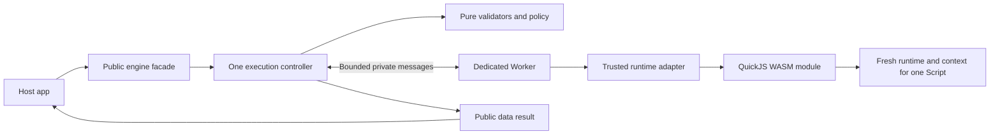
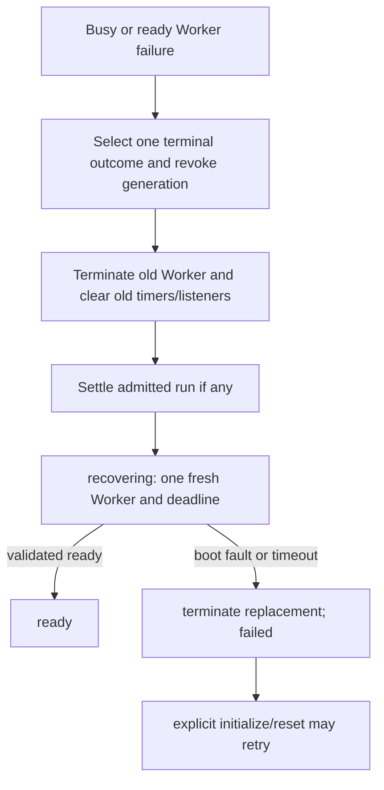
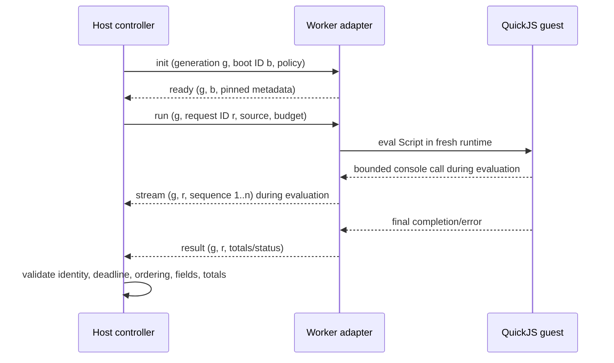

# Execution, initialization, recovery, failures, and races

Status: **PROPOSED** Phase 1 control architecture, 2026-09-24. No engine or Worker has been implemented. The [Stage 0 API](../api.md), [lifecycle table](../architecture.md#lifecycle-states), [protocol](../protocol.md), and [ownership map](components.md) are the canonical contracts; this document makes their sequencing and failure cases explicit.

## Component flow



The facade and controller are host-side library code. The adapter, QuickJS binding, and WASM run inside the Worker. Guest source crosses only as data. The Worker/adapter/runtime split is functional; it does not imply multiple Worker threads, interchangeable runtime plugins, or an external service.

## Initialization flow

```mermaid
sequenceDiagram
    participant H as Consumer
    participant C as Controller
    participant W as Dedicated Worker
    participant A as Adapter
    participant Q as QuickJS WASM
    H->>C: initialize()
    C->>C: created/failed -> initializing; allocate generation and boot ID; start deadline
    C->>W: construct fixed module Worker URL
    W->>A: load trusted adapter module
    C->>A: init(policy/version, generation, boot ID)
    A->>Q: acquire fixed WASM asset; compile/instantiate binding
    Q-->>A: module available
    A->>A: check policy/variant and limited self-check
    A-->>C: ready(metadata, matching identity)
    C->>C: validate; cancel deadline; initializing -> ready
    C-->>H: resolve initialize()
```

The actual order is Worker script loading, `init` handshake, then adapter-driven WASM acquisition/instantiation. The Stage 0 conceptual diagram placed asset loading before Worker initialization; that was illustrative, not a requirement to fetch WASM on the host page. Static Worker/ESM modules may load before the adapter can receive `init`; their failure is observed through Worker `error` or host timeout. The host begins its deadline **before** Worker construction, so those failures cannot leave `initializing` forever.

Only a validated `ready` for the current Worker/generation/boot ID and expected runtime/variant/policy can enter `ready`. A boot failure/timeout terminates the partially initialized Worker and enters `failed`; no partial QuickJS state is reused. A later explicit `initialize()`/`reset()` retries. Overlapping `initialize()` calls join one boot; `reset()` during boot revokes that generation and starts one replacement boot. The adapter may use package-selected ESM/wasm loading APIs; their exact emitted asset paths and CSP behavior remain **UNVERIFIED** until Phase 2 integration.

## One run: ordered stages

```mermaid
sequenceDiagram
    participant H as Consumer
    participant C as Controller
    participant A as Worker adapter
    participant Q as Fresh QuickJS runtime/context
    H->>C: run(request)
    C->>C: validate shape, sizes and lifecycle; assign ID; ready -> busy; start deadline
    C->>A: run(source, label, budget, generation, request ID)
    A->>A: validate envelope/policy/phase
    A->>Q: create runtime/context, set limits, install console, eval Script
    loop During evaluation, if console is called
        Q-->>A: bounded guest-formatted text
        A-->>C: bounded stream chunk
    end
    Q-->>A: completion or guest exception handle
    A->>A: bounded extraction; dispose handles/context/runtime
    A-->>C: final result
    C->>C: check Worker, generation, ID, phase, deadline, schema, totals
    C->>C: normalize once; cancel deadline; busy -> ready
    C-->>H: resolve ExecutionResult
```

| Stage | Location and scheduling | Boundary/failure/cancellation point |
| --- | --- | --- |
| Public input validation | Host, synchronous work before run admission; public method still returns a Promise | Reject invalid/over-limit data before encode/Worker dispatch; no runtime effect |
| State check/admission | Host, one synchronous controller turn | Disposed wins first; then validation; `BUSY`/`NOT_READY` reject. Set `busy`, ID, start time/deadline before sending |
| Encode/post | Host to Worker, asynchronous delivery | Bounded JSON string, same current generation/ID; posting failure is admitted engine failure and invalidates Worker |
| Worker validation | Trusted adapter before guest creation | Reject unknown/oversize/misordered fields; current operation protocol fault invalidates Worker |
| Guest preparation | Worker, synchronous QuickJS API work | New QuickJS runtime and context per run; configure heap/stack/interrupt **before** eval; setup failure is engine error |
| Script evaluation | Worker, synchronous guest interpreter | Guest syntax/exception -> program error; infinite loop -> interrupt or external host termination; no Promise job drain |
| Console/output | Worker guest-to-adapter callback; host receives chunks asynchronously | Bound primitive formatting before FFI copy; guest cannot post arbitrary native messages; host accumulates only validated chunks |
| Error extraction/cleanup | Worker while execution deadline remains active | Bounded guest fields and explicit handle disposal; trap/cleanup failure invalidates generation |
| Final validation/normalization | Host on Worker event | Reject stale identity **before** parse/state changes; check host deadline even if timer callback has not fired; build public snapshot, then clear run and enter ready |

There is no separate host-side “prepare runtime” per request: the **Worker adapter** creates the per-run QuickJS runtime. A warm WASM module and Worker remain between clean runs. The execution deadline includes adapter cleanup and final host response validation. No other run is admitted until the prior guest runtime is disposed and its validated final result processed.

Ordinary `console.log("hello")` and `const x = 10` execute synchronously. `setTimeout` is absent and a direct call becomes a guest `ReferenceError` unless guest source defines its own name. An `async function` declaration is allowed; invoking it can run its synchronous prefix and produce a Promise, but the engine neither awaits it nor drains its jobs. See the exact [`script-sync-v1` contract](../api.md#execution-semantics).

## Cancellation flow

```mermaid
sequenceDiagram
    participant H as Consumer
    participant C as Controller
    participant W1 as Old Worker
    participant W2 as New Worker
    H->>C: cancel() while busy
    C->>C: choose CANCELLED once; revoke generation and listeners
    C->>W1: terminate()
    C-->>H: run promise resolves engine-error CANCELLED
    C->>C: busy -> recovering; start one recovery deadline
    C->>W2: construct fresh Worker; init new generation
    W2-->>C: validated ready or failure
    C-->>H: cancel promise resolves at ready or rejects recovery failure
```

`cancel()` is received by the host controller. It returns `Promise<void>` for **readiness**, not the cancelled run's result. The admitted run resolves separately with engine status `CANCELLED`. A blocked old Worker is not asked to cooperate: generation revocation precedes `Worker.terminate()`. The API does not wait for a termination acknowledgment the browser does not provide. Old output already validated may be retained; queued old events after revocation are ignored.

If `cancel()` is called during initialization, there is no admitted run, so it resolves as a no-op and the original initialization continues. If a final result has already been accepted and state is ready, it also resolves as a no-op. If the Worker posted a result but the host has not processed it, the engine is still busy and cancellation may win; whichever valid host event is processed first sets the one terminal outcome. In `recovering`, cancellation joins current readiness. In `disposed`, it rejects `DISPOSED`.

## Timeout and failure recovery



The **host controller** is the only authority for public timeout outcomes and lifecycle transitions. Its monotonic deadline starts before construction, dispatch, or recovery work respectively. The Worker-local QuickJS interrupt hook is a faster execution guard using a relative budget; it can signal expiry, but cannot transition the public state or keep an unsafe runtime alive. On any execution timeout, the host terminates and replaces the entire Worker/WASM generation. The same replacement occurs for Worker `error`/`messageerror`, WASM trap, current protocol violation, adapter failure, and failed guest cleanup. A clean guest exception is reported and followed by normal per-run cleanup; it does not trigger replacement.

Initialization failure enters `failed` directly; it is not an automatic recovery loop. An active/idle runtime failure starts **one** replacement attempt. Recovery failure enters stable `failed` and rejects readiness waiters. The original admitted run keeps its chosen error result even if recovery later fails. `dispose()` supersedes any in-progress recovery and makes `disposed` terminal. Timers rely on a running host event loop; suspended tabs may delay observation, and there is no browser-wide memory/CPU guarantee.

## Message flow



`init`, `ready`, `run`, `stream`, `result`, and `fatal` are private transport types. Cancel/reset/dispose terminate/recreate from the host and have no Worker message. A Worker result is sent only after per-run cleanup succeeds. No public streaming callback is promised. The exact [protocol grammar and validation outcomes](../protocol.md) govern both directions.

## Failure-mode matrix

| Trigger / stage | Admitted run or caller outcome | State and resource action | Stale/cleanup rule |
| --- | --- | --- | --- |
| Invalid request or input limit, before admission | Reject `INVALID_REQUEST` or `INPUT_LIMIT` | State unchanged; no Worker dispatch | No ID consumed |
| `run()` in created/initializing/recovering/failed | Reject `NOT_READY` | State unchanged | Existing operation untouched |
| Concurrent `run()` in busy | Reject `BUSY` | First run continues | No queue |
| `run()` after dispose | Reject `DISPOSED` | Terminal unchanged | No work |
| Worker creation/asset load/metadata failure on first boot | `initialize()` rejects `INITIALIZATION_FAILED` or `UNSUPPORTED_ENVIRONMENT` | Terminate partial Worker, enter failed | Reject coalesced waiters once |
| Initialization timeout | `initialize()` rejects `INITIALIZATION_TIMEOUT` | Terminate partial Worker, enter failed | Ignore later ready |
| Syntax/runtime guest exception | Resolve `program-error` | Dispose guest handles/context/runtime; busy -> ready if cleanup succeeds | Bound guest fields; no raw Error |
| Guest-thrown odd value / hostile getter | Resolve bounded program fallback if extraction safe; otherwise `RUNTIME_FAILURE` | Normal cleanup or terminate/recover on integrity failure | Extraction under deadline |
| QuickJS heap/stack control reports trusted exhaustion | Resolve `engine-error` `RESOURCE_LIMIT`; ambiguous case `RUNTIME_FAILURE` | Invalidate Worker and recover | No name/message-based trust |
| Infinite guest loop | Timeout result `EXECUTION_TIMEOUT` or earlier cancel | Revoke, terminate, recover | Local hook alone never proves safe reuse |
| Host execution deadline before/at result processing | Resolve `engine-error` `EXECUTION_TIMEOUT` | Terminate/recover even if a result arrived | Deadline check precedes accepting result |
| `cancel()` during busy | Run resolves `engine-error` `CANCELLED`; cancel caller waits for readiness | Terminate/recover | First terminal host decision wins |
| `reset()` during busy or initializing | Run resolves `RESET`; superseded initialization rejects `RESET` | Terminate/recover | Replacement waiters join one boot |
| Worker `error`, `messageerror`, or posting failure | Active run resolves `WORKER_FAILURE`; boot waiter rejects; idle fault starts recovery | Terminate active Worker; recover unless boot failure | Watchdog covers silent loss |
| WASM trap / adapter / cleanup failure | Active run resolves `RUNTIME_FAILURE`; boot waiter rejects initialization failure | Terminate/recover, or failed during boot | Do not reuse partial instance |
| Malformed/oversized/wrong-order current message | Active run resolves `PROTOCOL_ERROR`; boot waiter rejects initialization failure | Terminate/recover or failed | No thrown host event handler exception |
| Stale former generation or completed ID | No new settlement | Current state/resource unchanged | Ignore before parse/mutation |
| Impossible future ID/generation from current Worker | Active run `PROTOCOL_ERROR` or boot failure | Terminate/recover or failed | Never attach to newer request |
| Duplicate final/stream after completion | No new settlement | Current operation unchanged | Retired ID ignored |
| Recovery boot error/timeout | Current recovery waiters reject `RECOVERY_FAILED`/`RECOVERY_TIMEOUT` | Terminate partial replacement; enter failed | Original run result unchanged |
| Dispose from any state | Active run resolves `DISPOSED`; readiness/control waiters reject `DISPOSED` | Revoke, terminate, clear all, enter disposed | All late events ignored |

`RUNTIME_FAILURE` and `WORKER_FAILURE` are public **engine** errors. “Runtime error” in this matrix means infrastructure failure, not a guest `TypeError` or `ReferenceError`. The [public taxonomy](../api.md#program-errors-versus-engine-errors) remains the single contract.

## Race-condition matrix

The host processes events in one controller turn at a time. Every asynchronous closure carries Worker identity, generation, operation ID, and expected phase. A terminal latch settles each admitted run/boot at most once. Processing a valid result at or after its host deadline selects timeout even if the timer callback is queued behind it.

| Overlap | Admission/order result | State after decisive event | Worker/action |
| --- | --- | --- | --- |
| `initialize()` + `initialize()` | Both join same readiness attempt | ready or failed | One Worker; no second boot |
| `initialize()` + `reset()` while booting | Old readiness rejects `RESET`; reset waits on replacement | recovering -> ready/failed | Old Worker terminated, new generation |
| `initialize()` during busy | Resolves immediately; run unaffected | busy | No extra Worker |
| `run()` + `run()` | First admitted; second rejects `BUSY` | busy until first terminal | No queue or second ID |
| `run()` + `cancel()` | Cancel wins if run still busy; run result `CANCELLED` | recovering -> ready/failed | Old Worker terminated |
| Accepted result + later `cancel()` | Result is fixed; cancel no-op in ready | ready | Worker retained |
| Posted but unprocessed result + `cancel()` | First host-processed valid event wins | ready or recovering | Retain or terminate accordingly |
| `run()` + host timeout | Timeout wins at deadline unless valid result processed earlier | recovering -> ready/failed | Terminate old Worker |
| Result event processed at deadline before timer callback | Treat as `EXECUTION_TIMEOUT` | recovering -> ready/failed | Terminate old Worker |
| `run()` + `reset()` | Active run result `RESET`; reset awaits replacement | recovering -> ready/failed | Terminate old Worker |
| `run()` + `dispose()` | Active run result `DISPOSED`; later calls reject | disposed | Terminate; no replacement |
| `cancel()` + `reset()` during recovery | Both join same replacement readiness | recovering -> ready/failed | No second replacement |
| `cancel()` + late result/stream/error | Old generation ignored before mutation | recovering/current | No output/timer/state change |
| Old `ready` after reset created a new Worker | Old generation ignored | initializing/recovering of new boot | No old metadata/ready transition |
| Old timeout after replacement run begins | Old callback identity ignored | current run state unchanged | Never terminate new Worker |
| Worker failure + `dispose()` | First run terminal outcome fixed; dispose is terminal | disposed | No recovery survives disposal |
| Recovery failure + explicit retry | Existing readiness rejects once; later explicit call starts new boot | failed -> initializing | New generation and deadline |
| Duplicate result or stream after completion | Ignore retired ID | current state unchanged | No duplicate settlement/output |
| Future ID/invalid current payload | Protocol fault | recovering or failed during boot | Invalidate current Worker |

`reset()` in ready always replaces the Worker, even though fresh guest state is already guaranteed per run. `reset()` during recovery joins the replacement already underway. `cancel()` in created/initializing/ready/failed is a no-op; in disposed it rejects. No lifecycle operation queues a run. These are deliberate decisions documented in the [Stage 0 contract](../architecture.md#operation-semantics-and-races), now expressed as executable acceptance cases for a later implementation.
